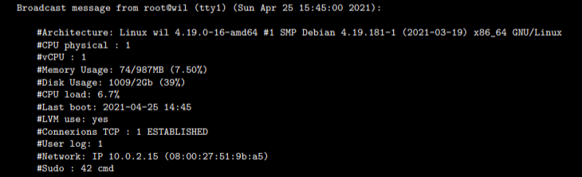

# Born2beroot(사전 조사 중)

### 모르는 단어 정리

- [ ]  Virtual Box
- [ ]  UTM
- [ ]  Graphical Server
- [ ]  Linux Server(CLI 구축)
- [ ]  KDump, SELinux, AppArmor
- [ ]  LVM
- [ ]  groups
- [ ]  encryption partition
- [ ]  aptitude vs apt
- [ ]  SSH Service
- [ ]  port
- [ ]  UFW
- [ ]  DNF
- [ ]  TTY

### 조사 내용

[조사내용 정리](https://www.notion.so/92e36c531ba64b3bbb4e423455d1bd07)

## Chapter I Preamble

⇒ Preamble

## Chapter II Introduction

이 프로젝트는 알흠다운 가상화 세계로 당신을 초대하는 것을 목적으로 삼고 있습니다. 

이 프로젝트에서 당신은 VirtualBox(혹은 사용 불가능 하다면 UTM)의 가상머신을 구체적인 지시 사항 하에 구축해볼 것입니다. 그 뒤, 이 프로젝트 후에는 당신의 엄격한 기준아래에서 실행되는 동안, 당신 만의 운영체제를 구축할 수 있게 될 것입니다. 

## Chapter III General guidelines

- Virtual Box (혹은 사용이 불가능할 시 UTM)의 사용은 필수입니다.
- 당신은 signature.txt 만 레포지터리 최상단에 제출 해야 합니다. 반드시 해당 파일의 가상화 머신의 virtual disk를 siginiture을 붙여 넣기 하십시오. 더 많은 정보는 Submission and peer-evaluation 을 참고 하세요.

## Chapter IV Mandatory part

이 프로젝트는 다음 구체적인 기준에 의해 당신의 최초 서버 세팅에 관하여 구성하고 있다. 

> 서버를 세팅하는 것에 관한 문제이기 때문에, 당신은 몇가지 서비스를 설치할 것입니다. 이러한 연유로, GUI는 사용하지 않습니다. 그러므로 X.org를 비롯해서 다른 동일한 graphical server는 사용이 금지 됩니다. 게다가 0점을 받을 수 있구요.
> 

만약 system administration에서 뉴비라면, 당신이 반드시 최신의 stable 버전의 Debian (테스팅 버전이나, unstable 버전 X)이나 최신 stable 버전의 CentOS를 고르기를 추천한다. 

> CentOS의 설치는 꽤 복잡합니다. 그러므로 KDump 를 설정할 필요는 없습니다. 그러나 SELinux는 반드시 구동시 작동 되어야 합니다 그리고 그것의 설정도 반드시 project의 필요에 따라 적용되어 있어야 합니다. 데비안을 위한 AppArmor 도 반드시 구동되어야 합니다.
> 

당신은 반드시 최소 2개의 암호화된 파티션을 LVM을 사용해 만들어야 합니다. 아래의 예시가 예상되는 파티션 구조 입니다. 

> 디펜스 동안, 당신이 선택한 OS에 대하여 몇가지 질문을 요청받게 될 겁니다. 예를 들어, aptitude 와 apt  사이의 차이에 관해 당신은 확실하게 알아야 할 것이고, 혹은 SELInux나 AppArmor가 무엇인지에 대해 알아야 합니다. 짧게 말하면 너가 무엇을 쓰고있는지 이해하라는 뜻입니다!
> 

✔ SSH  서비스는 4242 포트로만 운영되어야 합니다. 보안 이유 때문에, 루트 상에서 SSH 사용하여 연결하는 것은 반드시 불가능해야합니다. 

> SSH의 사용은 새로운 계정에서 설정함으로써 디펜스 동안 테스트되어야 합니다.   그러므로 반드시 이것이 어떻게 작동하는지 이해햐아 합니다.
> 

✔ 반드시 UFW 방화벽과 함께 당신의 OS 설정해야 합니다. 그리고마녀 4242포트를 open 상태로 남겨둡니다. 

> 당신이 virtual machine 을 기동했을 때, 반드시 방화벽은 작동되어야 합니다. CentOS 를 예를 들면, UFW가 기본 방화벽을 대신하여 사용되어야 합니다. 이것을 설치 시 당신은 아마도 DNF가 필요할 것입니다.
> 
- 당신의 virtual machine 의 호스트명은 반드시 당신의 로그인 아이디와 끝에 42가 붙여져 있어야 합니다. 평가 동안 이 호스트명은 반드시 수정 되어야 합니다.
- 강력한 패스워드 규칙을 실행시켜야 합니다.
- 강력규정에 따라 sudo 를 설정하고, 설치해야 합니다.
- 루트 유저로써, 유저명으로 당신의 로그인과 함께 유저는 반드시 표시되어야 합니다.
- 이 유저는 반드시 user42 그리고 sudo  그룹들에 속해있어야 합니다.

> 디펜스 동안, 당신은 새로운 유저를 생성해야하고, 이를 그룹에 지정해야 합니다.
> 

✔ 강력한 패스워드 규정을 설정하기 위하여, 당신은 다음 필수 조건을 준수해야합니다. 

- 패스워드는 매 30일마다 만료되어야 합니다.
- 비밀번호 수정이 전에 허가되는 최소 일자는 2일로 설정됩니다.
- 당신의 패스워드는 반드시 최소 10자 길이어야 합니다. 반드시 대문자와 숫자를 포함해야 합니다. 또한 반드시 3개의 연속되는 문자보다 많이 포함하고 있으면 안됩니다.
- 패스워드는 반드시 사용자명을 포함해선 안됩니다.
- 다음 룰은 루트 패스워드에는 적용되지 않습니다. : 패스워드는 반드시 이전 패스워드의 부분이 아닌 적어도 7글자를 가져서는 안됩니다.
- 물론, 당신의 루트 패스워드는 이 규정을 준수해야 합니다.

> ❗ 당신의 설정 파일을 설정 후에, 반드시 virtual machine 상에 현재 계정들의 모든 패스워드들은 변경되어야 합니다. (루트 계정을 포함)
> 

당신의 sudo 그룹을 위해 강력한 설정을 세팅하기 위하여, 다음 필수 조건들을 준수하여야 합니다. 

- Authentication using sudo 는 적절하지 않은 패스워드 이벤트에 대해 3회의 시도로 제한 됩니다.
- 만약  sudo 사용 시 잘못된 패스워드를 입력함으로 생기는 에러 발생 시 당신의 선택에 대한 커스텀 메시지는 반드시 표지 되어야 합니다.
- 각 sudo 를 이용하는 행동, 입력과 출력둘다 보관되어야 합니다. 해당 로그는 반드시 `/var/log/sudo`  폴더에 저장되어야 합니다.
- 보안 상 이유로, `TTY` 모드는 반드시 실행되어야 합니다.
- 보안 상 이유로, sudo 에 의하여 사용될 수 있는 경로는 반드시 제한되어야 합니다. 예를 들면 
`/usr/local/sbin: /usr/local/bin: /usr/sbin: /usr/bin: /sbin: /bin: /snap/bin`

마지막으로, `monitoring.sh` 라는 단순한 스크립트를 만들어야 합니다. 이는 반드시 bash에서 개발되어야 합니다. 

서버를 기동할 때, 해당 스크립트는 다음 몇가지 정보를 매 터미널의 10분 간격으로 표지합니다(wall 을 참고하세요). 배너는 선택상항이며, 에러는 보여져서는 안됩니다. 

- 당신의 스크립트는 반드시 다음 정보들을 포함합니다.
    - 당신의 운영체제의 구조와, 이의 커널 버전을 출력합니다.
    - 물리적 프로세서의 개수
    - 가상 프로세서의 개수
    - 당신의 서버 상의 현재 가용 렘 그리고 메모리 사용률
    - 당신의 서버 상의 최근 가용 메모리 그리고 메모리 사용률
    - 당신의 최근 프로세서의 사용률의 퍼센티지
    - 최근 리부트의 날짜와 시간
    - LVM 가동 중인지 아닌지
    - 활성 중인 커넥션의 수
    - 서버 사용 유저의 수
    - 서버의 IPv4 주소 그리고 해당 MAC(Media Access Control) 주소
    - sudo 프로그램과 함께 실행된 명령의 개수
    
    > 디펜스 동안, 당신은 어떻게 이 스크립트가 작동하는지를 질문 받을 것입니다. 당신은 이것의 수정 없이 방해할 수 있어야 한다. cron을 참고할 것
    > 
    
    이 스크립트 작동 시의 예제 
    
    
    
    더불어 아래 서브젝트의 요구사항 몇가지를 체크하는 두 커맨드들이다. 
    
    
    

## Chapter V Bonus part

- 보너스 리스트 :
    - 아래 이미지와 유사한 구조의 파티션들을 정확하게 설정해라
    - 다음 서비스들을 활용해 기능적인 WordPress 웹사이트를 설정하라 : lighttpd, MariaDB, PHP
    - 유횽하다고 당신이 생각하는 서비스를 골라, 설정하십시오(NGINX / Apached2 제외). 디펜스 동안, 당신의 선택을 정당화하라.

> 이 보너스를 성공시키기 위하여, 당신읜 추가적 서비스를 설치해야할 가능성이 있다. 이러한 경우, 당신은 당신의 필요를 충족코자 아마 더 많은 포트를 open 해야합니다. 그러므로 UFW 규칙은 이에 따라 조정되어야 한다.
> 

> ❗ 보너스 파트는 필수 파트가 완벽하다면 평가 될 것입니다. '완벽함' 이란 필수 파트를 전체적으로 수행하고, 오류 없이 완벽하게 작동하는 것을 의미합니다. 만약 '모두' 필수 파트의 요구사항을 통과하지 못하면, 보너스 파트는 결코 평가될 수 없습니다.
> 

## Chapter VI Submission and peer-evaluation

당신은 당신의 Git repository 에 siginature.txt 만을 제출해야 합니다. 당신은 반드시 virtual disk의 머신의 signature 를 붙여넣기 해야 합니다. 이 signature를 얻기 위해선, 우선 기본 설치 폴더를 열어야 합니다.(이는 VM이 저장되어있는 폴더에 있습니다.) 

- Windows : %HOMEDRIVE%%HOMEPATH%\VirtualBox VMs\
- Linux : ~/VirtualBox VMs/
- Mac M1: ~/Library/Containers/com.utmapp.UTM/Data/Documents/
- MacOS : ~/VirtualBox VMs/

그 다음, sigature 를 from 당신의 가상 머신의 sha1 포멧의"*.vdi" 파일로부터 검색하세요.(혹은 .cow2 for UTM 사용자) 아래의 목록은 centos_serv.vdi파일을 위한 4개의 커맨드 예시입니다. 

- Windows : certUtil -hashfile centos_serv.vdi sha1
- Linux : sha1sum sentos_serv.vdi
- For Mac M1 : shasum Centos.utm/Images/disk-0.qcow2
- MacOS : shasum centos_serv.vdi

이것은 당신이 얻을 아웃풋이 무슨 종류인지의 예시입니다. 

- 6e657c4619944be17df3c31faa030c25e43e40af

> 주의하세요. 당신의 virtual machine 의 signature 당신의 최초 평가 이후 수정될 수 있습니다. 이 문제를 해결하기 위하여, virtual machine을 복사하거나, 혹은 상태를 저장하여 사용하십시오.
> 

> ❗ 물론, 당신의 깃 레포지터리에 가상머신을 제출하는 것은 금지입니다. 디펜스 동안 signature.txt의 signature 는 당신의 virtual machine 의 하나와 비교될 것입니다. 만약 그들 중 둘이 동일하지 않다면, 당신은 0점을 받을 겁니다.
>
